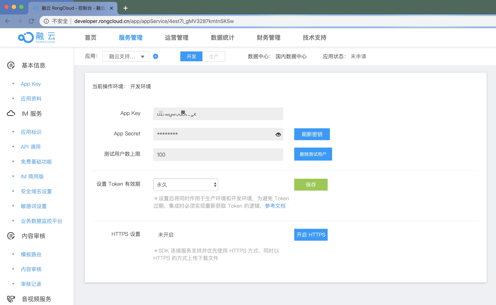
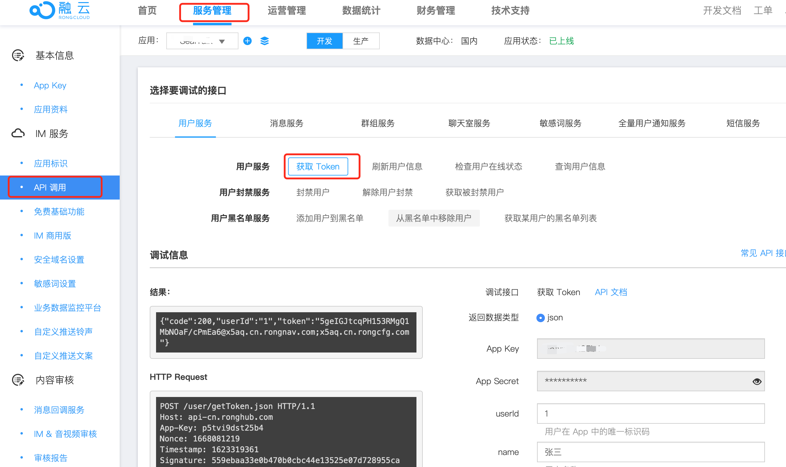
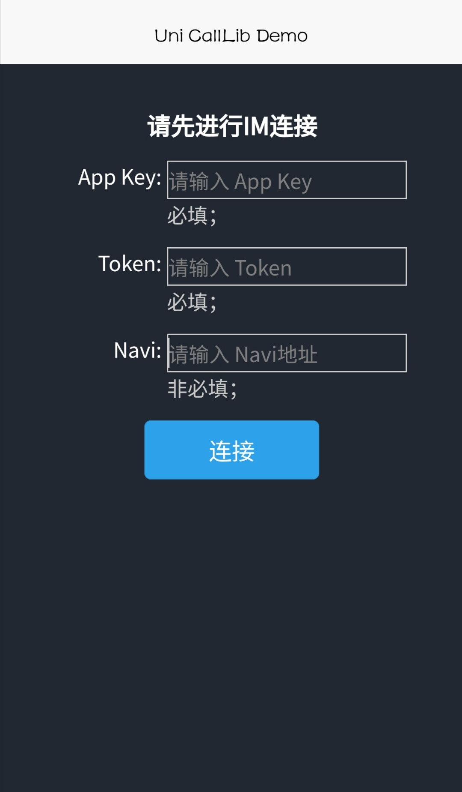

# 融云音视频通话 CallLib uni-app 示例应用

融云 uni-app calllib 音视频产品提供一个 QuickDemo 示例应用项目（[项目地址](https://github.com/rongcloud/uni-calllib)），集中演示了融云音视频通话在 Android 和 iOS 端的功能，以便开发者体验产品，快速集成，实现单群聊、音视频通话等场景需求。

## 环境要求

- **HBuilder X**： 建议最新版本
- **Android**：4.4 及以上
- **iOS**：9.0 及以上

## 融云开发者账户

融云开发者账户是使用融云 SDK 产品的必要条件。

在开始之前，请先前往 [融云官网注册开发者账户](https://developer.rongcloud.cn/signup),注册成功后，融云开发者后台会默认自动创建您的首个应用，默认在开发环境下，使用国内数据中心,请获取应用的 App Key 和 App Secret，在本教程中使用。

前往[开发者后台获取 App Key 页面](https://developer.rongcloud.cn/app/appkey/)

如果已拥有融云开发者账户，可以直接选择合适的环境创建应用。如果仅为体验 QuickDemo 创建应用，建议选择国内数据中心。如果选择海外数据中心，则需要额外在 QuickDemo 中修改 SDK 连接的服务地址。配置方法可参见 [数据中心](https://doc.rongcloud.cn/rcloud/-/-/data-center)

<!-- Gif 占位符 -->


您需要记录上图所示的应用 App Key 和 App Secret，在本教程中使用。

应用的 App Key / Secret 是获取连接融云服务器身份凭证的必要条件。App Secret 用于生成数据签名，在请求融云服务端 API 接口时使用。请注意不要泄露。

## 开通音视频服务

开发环境下的每个应用均可享有 10000 分钟免费体验时长。如果在开发环境下开通音视频服务，可直接按照以下步骤开通音视频服务。服务开通后即可开始免费体验和测试。免费体验时长用完即止。

如果在生产环境下开通音视频服务，则需要先预存费用，才可开通。详情请参考[开通音视频服务](https://doc.rongcloud.cn/call/uni-app/5.X/rtc-service)。

1. 登录[融云开发者后台]，在页面顶部点击**服务管理**。

2. 在页面左侧导航栏，找到「音视频服务」分类下的**音视频通话**点击进入页面，开通免费体验。

    [前往开发者后台「音视频通话服务」开通页面](https://developer.rongcloud.cn/rtc/rtc/J1mQ8uFcrGVoMxK_AmTqSQ)

3. 服务开通、关闭等设置完成，最长 30 分钟后生效。

## 获取 Token

应用客户端必须连接融云服务器才能使用融云即时通讯功能。连接时必须传入 Token 参数。Token 是与用户 ID 对应的身份验证令牌，是应用客户端用户在融云的唯一身份标识。

在实际业务运行过程中，应用客户端需要通过应用的服务端向融云服务端申请取得 Token，具体方法可参考 [Server API 获取 Token]。

在本教程中，为了快速体验和测试 SDK，我们从融云开发者后台获取两个用户 Token，用于后续体验。

1. 登录[融云开发者后台]，在页面顶部点击**服务管理**。

2. 页面左侧找到 **IM 服务**，依次点击 **API 调用** > **用户服务** > **获取 Token**。

3. 根据页面提示，填写 **userId**，并提交。

    在以下示例中，我们将获取到 **userId** 为 1 的用户的 Token。

    

    提交后，可在左侧**结果**中取得 Token 字符串。记录下该 Token，用于体验时使用。

4. 重复上一步，获取 **userId** 为 2 的用户的 Token。记录下该 Token，用于体验时使用。

## 运行 QuickDemo

1. 在运行 QuickDemo 前请确保已完成上述步骤。以下是检查清单:

   - 已注册融云开发者账户
   - 已准备好 App Key
   - 已开通音视频服务免费体验，且已等待 30 分钟
   - 已获取用于体验的两个 Token
   - 下载并安装 [HBuilder X](https://www.dcloud.io/hbuilderx.html)

2. QuickDemo [项目地址](https://github.com/rongcloud/uni-calllib)。

    **克隆下载示例代码**

    ```shell
    git clone https://github.com/rongcloud/uni-calllib.git
    ```

    注意，QuickDemo 示例代码在 `uni-calllib/example` 目录下。

3. 在 HBuilderX 中，打开 `uni-calllib/example`。

4. 进入 `example`，通过 NPM 下载 CallLib，IMLib 的安装包：

    ```js  
    npm i @rongcloud/imlib-uni -S

    npm i @rongcloud/calllib-uni -S
    ```

5. 前往 DCloud 插件市场，购买下列融云 uni-app 原生插件，或将插件下载到本地：

    * 融云即时通讯 SDK uni 原生插件 `RCUniIm`：
        https://ext.dcloud.net.cn/search?q=RCUniIm
    * 融云实时音视频 SDK uni 原生插件 `RCUniCall`：
        https://ext.dcloud.net.cn/search?q=RCUniCall

6. 使用 HBuilder X 导入原生插件，并完成相应配置。

    请根据项目打包方式，选择合适的步骤：

    - 云打包适用：

        1. 在 HBuilder X 中，打开项目的 `manifest.json` 文件。
        2. 点击 **App原生插件配置** -> **选择云端插件** -> 选中 **RCUniIM(RCUniCall)**。

    - 本地打包适用：

        1. 使用 HBuilder X 在项目根目录下创建 `nativeplugins` 文件夹。
        2. 将下载的插件解压之后放入 `nativeplugins` 文件夹中。
        3. 在 HBuilder X 中，打开项目的 `manifest.json` 文件。
        4. 点击 **App原生插件配置** -> **选择本地插件** -> 选中 **RCUniIM(RCUniCall)**。

7. 在 HBuilder X 中，点击 **运行** -> 点击 **运行到手机或模拟器** -> 点击 **制作自定义调试基座**

8. 制作基座完成后：
   * 在 HBuilder X 中，点击 **运行** -> 点击**运行到手机或模拟器** -> 点击 **运行基座选择** -> 选择 **自定义调试基座**。
   * 连接 Android 或 iOS 手机，HBuilder X 点击 **运行** -> 点击 **运行到手机或模拟器** -> 点击 **已连接的手机**。

    

<!-- 链接区域 -->
[融云开发者后台]: https://developer.rongcloud.cn/overview/indexnew/w6jNnfHVsfaIcWOYc8j73w
